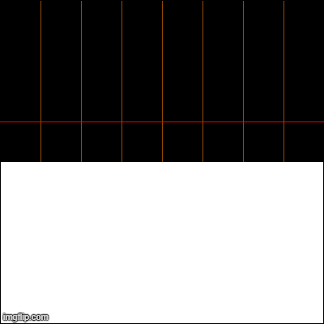

# Simple Cell Automata
<div align="center">
  


[](https://goreportcard.com/report/github.com/jtheiss19/Simple-Cell-Automata)

<a href="https://github.com/jtheiss19/Simple-Cell-Automata"></a>
</div>

## Table of Contents

- [Introduction](#Introduction)
- [Installation](#installation)
- [Features](#features)
- [License](#license)

# Introduction

# Installation

> go get github.com/jtheiss19/Simple-Cell-Automata

## Setup

> Navigate to the top folder and run the main package

```shell
$ cd $GOPATH/src/github.com/jtheiss19/Simple-Cell-Automata
$ go run .
```

# Features

# License

**[MIT license](http://opensource.org/licenses/mit-license.php)**
